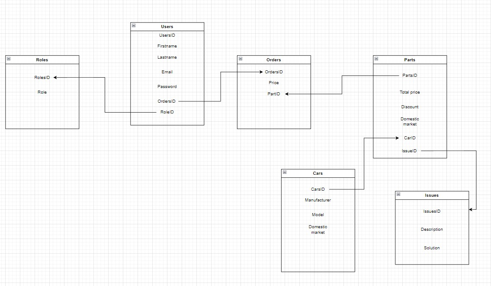

# car_parts_api
    
## General info
  Application that helps you find the car parts you need to do a quick fix or upgrade on your car based on the spec and model of your car.

## Features

### Users
 * Roles: admin,member,guest
 * Registration and login form
### Security
 * Password encryption
### Car part advisor
 * Wide choice of car parts
 * Filtering by car model/domestic market  
 * Suggestion for your problems
 * Alternative(domestic) parts
### Languages and tools
 * Java
 * Spring Boot
 * Thymeleaf
### Target users
 * People who enjoy building cars and know about them 
 * People who know very little about their cars and don't know the problem which occured
### Database 
 * 
### Contact 
 * [Ante Pera](https://github.com/AntePera)
 * [Nikola Bošnjak](https://github.com/LunarStrain94)
 * [Marin Šop](https://github.com/MarinSop)
